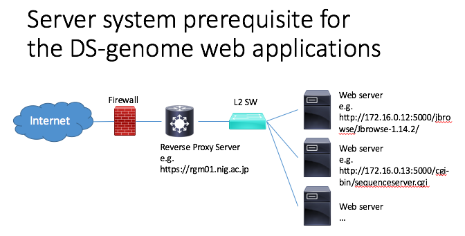
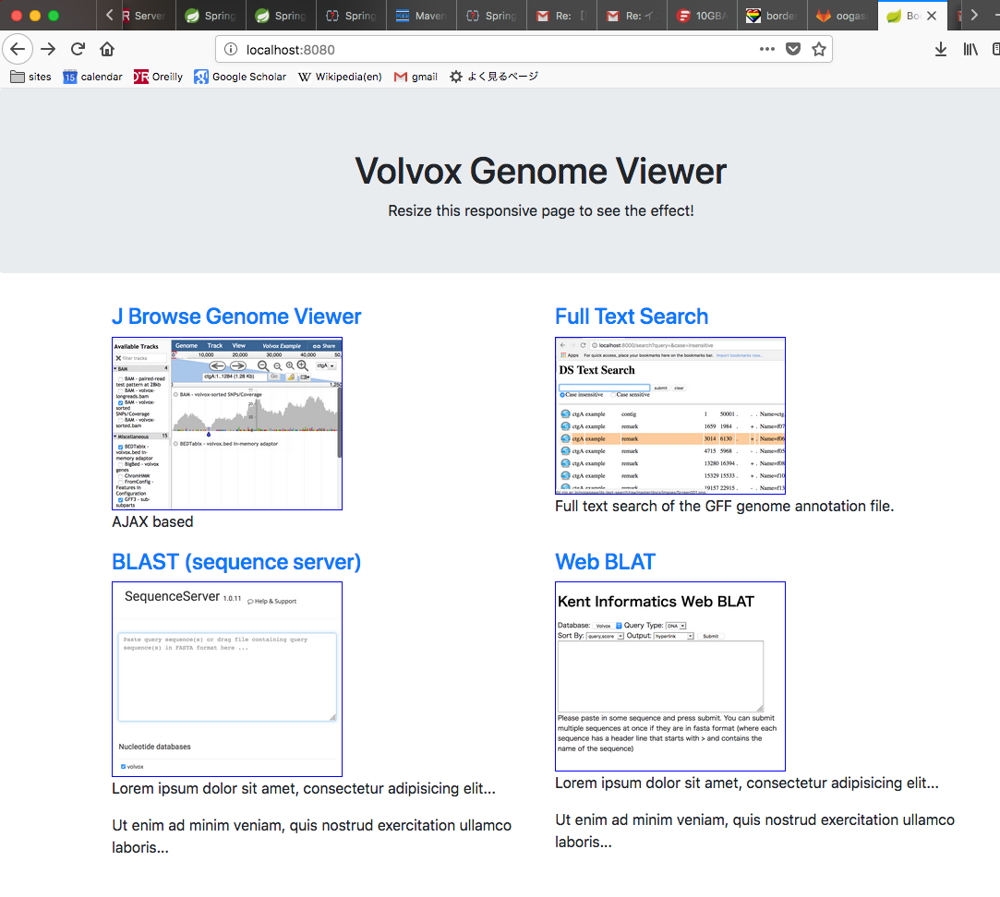

# DS Genome Top Page

先進ゲノムのゲノムブラウザはJBrowse、アノテーションの全文検索、BLAST, BLATが合わさってひとまとまりのサイトなる。
本Webアプリはそのポータルサイトである。

N50などいくつかの統計量をポータルサイトに表示するためにSpring Bootを使う。
（コンテナ不要でデプロイが簡単だからという理由もある。）

## 更新履歴

- version 0.4.1
  - リバースプロキシ構成に配備するための調整を行なった。
- version 0.2.0
  - Spring Boot ver.5 + Apache Tiles ver.3 + Bootstrap4で基本的な機能を作成した。リンク先URLは要調整。
  
### 未実装の機能

- エラー画面表示
- 統計量が書かれたCSVファイルを読み込んでトップページに表示する機能
  
## インストール方法

### 前提

- Java version 10
- Apache maven version 3.5.3
- git (version 2.15.2)

サーバー構成はリバースプロキシ配下にWebサーバーのクラスタがあることを前提とする。
以下ではリバースプロキシのURLのことをbaseUrlと呼ぶこととする。

### コンパイル方法

	git clone http://gitlab.ddbj.nig.ac.jp/oogasawa/ds-genome-top-page.git
	cd ds-genome-top-page
	git snapshot v0.4.1
	mvn -Dmaven.test.skip=true clean package
	
これによりtargetディレクトリの下にjarファイルが生成される。

## 起動方法

以下のコマンドでds-text-searchが動作するwebサーバーが8000番ポートで起動する。（デフォルトは8080)

    java -jar target/ds-genome-top-page-0.2.0.jar \
	    --server.port=8000 \
	    --baseurl='http://rgm01.nig.ac.jp' 

baseurlは、リンクの飛び先のサーバー名を表すURLである。

## 使い方

ブラウザで http://localhost:8000/ にアクセスする。

画面はApache Tiles + Bootstrap4を使って配置している。外観はおおよそ以下の通り。
これを生物種ごとに作っていけば良い。
（完全パラメータ化してもいいのだろうけれども、現時点では後日検討扱いとする。）

